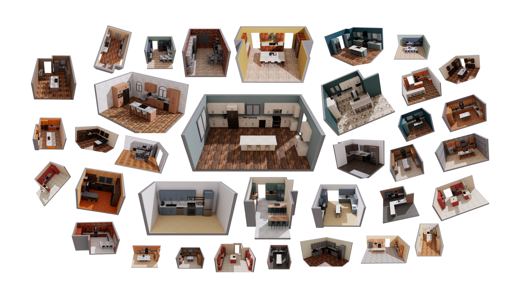

# LW-BenchHub

<div align="center">



**A unified benchmark hub built on Isaac Lab–Arena for embodied AI, providing consistent interfaces, realistic environments, multi-robot support, and ready-to-run large-scale evaluation.**

[](https://www.python.org/downloads/)
[](https://developer.nvidia.com/cuda-toolkit)
[](https://isaac-sim.github.io/IsaacLab/)
[](https://www.apache.org/licenses/LICENSE-2.0)
[](https://docs.lightwheel.net/lw_benchhub)


[Documentation](https://docs.lightwheel.net/lw_benchhub) • [Dataset](https://huggingface.co/LightwheelAI/datasets) • [Quick Start](#quick-start) • [Installation](#installation) • [Project Structure](#project-structure)

</div>

---

## Overview

**LW-BenchHub** is an end-to-end robotics simulation benchmark platform developed by the **Lightwheel team**, specifically designed for evaluating robots in kitchen manipulation and loco-manipulation tasks. Built on NVIDIA's **Isaac Lab-Arena**, LW-BenchHub provides a comprehensive platform that seamlessly integrates teleoperation data collection with reinforcement learning training workflows.

### Key Features

- **Multi-Robot Support** – Features 7 adapted robot types (Unitree G1, PandaOmron, DoublePanda, Agilex Piper, ARX X7s, Franka, and LeRobot SO100/101 Arm), comprising a total of 27 specific robot variants.
- **Realistic Kitchen Environments** – Large-scale kitchen scenarios with 10 layouts and 10 style combinations, offering 100 unique configurations using high‑fidelity assets pulled via the [Lightwheel SDK](https://docs.lightwheel.net/sdk/).
- **Flexible Input Devices** - Support for keyboard, VR(Vision Pro, PICO, Meta Quest), and Leader-Follower Arm.
- **Rich Task Suite** – 268 ready-to-use tasks (130 Lightwheel-LIBERO-Tasks, 138 Lightwheel-Robocasa-Tasks), covering kitchen manipulation, loco-manipulation, table-top actions, atomic skills, navigation, and long-horizon compositional tasks.
- **Complete Data Pipeline** - End-to-end workflow from teleoperation to policy deployment.
- **Intuitive and reproducible RL configuration design** – Supports generic RL configuration for a class of robots and tasks through a decorator-based binding mechanism, enabling modular registration and effortless switching or reproduction of RL setups. Seamlessly integrates with open-source RL libraries such as rsl-rl and skrl.
- **Large-scale Kitchen Manipulation Dataset** – Released a dataset with 219 unique tasks (89 from Lightwheel-Robocasa-Tasks, 130 from Lightwheel-LIBERO-Tasks) and 4 robots (LeRobot, ARX-X7s, Unitree G1, Agilex-Piper). The dataset contains 21,500 demonstration episodes (20,537,015 frames), with 50 episodes for each (robot, task) pair, captured in diverse, interactive kitchen environments. [👉 View and download the dataset on Hugging Face](https://huggingface.co/LightwheelAI/datasets)
- **Decoupled Policy API** – Adopts a server–client architecture that decouples policy execution from simulation-side environments and framework dependencies. Built with zero-copy data exchange, the API minimizes memory overhead and enables ultra-low-latency, high-throughput policy–simulation interactions.

## Quick Start

### Prerequisites

- **OS**: Linux (Primary support) / NVIDIA GPU required
- **Python**: 3.11
- **CUDA**: 12.8 (Recommended)
- **NVIDIA Driver**: 570.133.07 (Recommended)
- **Hardware**: NVIDIA RTX GPU for optimal ray-tracing performance

### Installation

1. **Create Conda Environment**
```bash
conda create -n lw_benchhub python=3.11 -y
conda activate lw_benchhub
```

2. **Quick Install**
```bash
sudo apt-get update
sudo apt-get install git-lfs
git lfs install

git clone https://github.com/LightwheelAI/lw_benchhub
cd lw_benchhub
git lfs pull
bash ./install.sh # Refer to the Documentation for custom installation steps
```


## Launch Your Task


### Teleoperation Data Collection

Start collecting demonstration data with different data collection configurations:

```bash
# Use PandaOmron robot configuration, `pandaomron.yml`
python ./lw_benchhub/scripts/teleop/teleop_main.py --task_config pandaomron
```

To enable recording demonstrations, set `record` to `true` in the configuration file.

```bash
record: true
```

### Trajectory Replay

Replay collected demonstrations for analysis:

```bash
# State-based replay
python ./lw_benchhub/scripts/teleop/replay_demos.py --dataset_file "/path/to/your/dataset.hdf5" --enable_cameras

# Action-based replay
python ./lw_benchhub/scripts/teleop/replay_action_demo.py \
    --dataset_file /path/to/your/dataset.hdf5 \
    --replay_mode action \
    --enable_cameras

# JointTarget-based replay
python ./lw_benchhub/scripts/teleop/replay_action_demo.py \
    --dataset_file /path/to/your/dataset.hdf5 \
    --replay_mode joint_target \
    --enable_cameras
```

### Reinforcement Learning

LW-BenchHub provides a complete RL pipeline:
#### Train
```bash
# Start training with default configuration
bash train.sh # default preset uses LiftObj (state variant)

# Custom training configuration
python ./lw_benchhub/scripts/rl/train.py \
    --task_config lerobot_liftobj_state \
    --headless
```
#### Evaluation

```bash
# Evaluate with default settings
bash eval.sh

# Custom evaluation
python ./lw_benchhub/scripts/rl/play.py \
    --task_config lerobot_liftobj_state_play
```


## Project Structure


### Core Components

| Component | Description |
|-----------|-------------|
| **configs** | This directory contains configuration files related to data collection, as well as the training and evaluation of reinforcement learning tasks. |
| **lw_benchhub** | This module provides `core` functionalities, including simulation scene generation, asset logic control, robot control, entry-point scripts, and utility functions. |
| **policy** | This directory focuses on the implementation of policy algorithms, covering both imitation learning (IL) and reinforcement learning (RL) strategies. The codebase is designed for modular experimentation and systematic benchmarking of various policy architectures. |
| **third_party** | This folder contains **Isaac-Lab Arena** dependency. To ensure reproducibility and maintainability, these environments are preserved in their original form as much as possible. |
| **lw_benchhub_tasks** | This directory defines task specifications. Each task, such as `OpenOven`, includes its own success criteria, task-related asset control and item placement, as well as a detailed task description. |
| **lw_benchhub_rl** | This module implements reinforcement learning (RL) pipelines, algorithms, and training/evaluation scripts. It includes preset configurations for common RL tasks, wrappers for integrating with `lw_benchhub.core`, and utilities for distributed experiment management. Use this module to launch RL experiments, customize RL agents, and evaluate learning performance. |

### Launch Scripts

- **`teleop.sh`** - Launches the teleoperation mode, allowing real-time robot control via VR controllers or other input devices. Useful for data collection, demonstration, or manual intervention scenarios.
- **`train.sh`** - Starts the training process for reinforcement learning or imitation learning. This script automatically loads configuration files, initializes environments and policies, and begins the training loop.
- **`eval.sh`** - Evaluates trained policies or models. Supports performance testing across different tasks and environments, and outputs evaluation metrics.
- **`install.sh`** - Installs all required dependencies for the project, including Python packages, third-party libraries, and some system dependencies, ensuring a consistent development and runtime environment.

## Documentation

For comprehensive guides, API references, and advanced usage examples, visit our [Official Documentation](https://docs.lightwheel.net/lw_benchhub).

## Citation

If you use LW-BenchHub in your research or projects, please cite us:

```
@software{Lightwheel_Team_LW-BenchHub_Lightwheel_s_End-to-End,
  author = {{Lightwheel Team}},
  title = {{LW-BenchHub: Lightwheel's End-to-End Embodied AI Simulation Platform}},
  url = {https://github.com/lightwheel-ai/lw_benchhub}
}
```


## License

This project is licensed under the [Apache License 2.0](https://www.apache.org/licenses/LICENSE-2.0).

Copyright 2025 Lightwheel Team
