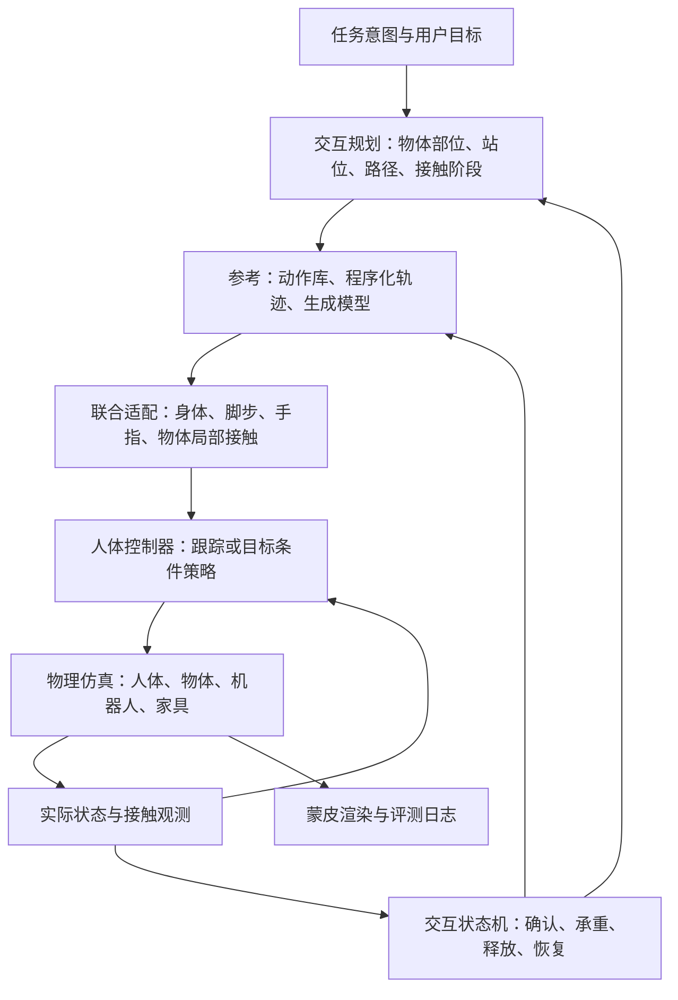

# 全身物理 human motion framework：备选方案与工程审阅

调研日期：2026-09-07。范围：审阅旧 `genesis-hr-bench` 与当前 `hrc-v2/isaac_kitchen`，查询论文、作者项目页及官方代码；本次只产出方案，未安装依赖、训练或运行仿真。文中的新接口、阶段和验收门槛均为设计建议。

**当前推荐已更新为 [面向 robot benchmark 的轻量升级方案](human_motion_benchmark_plan.zh-CN.md)。** 用户明确 human 是测试 robot 的交互变量，要求逼真、多样、实现较简单；因此全身物理平衡不再是升级前提。本页保留工程审阅和全身物理备选分支，以下执行约束不适用于新的轻量主线。

若以后单独实验全身物理控制，可看 [预训练推理路线与实验卡](human_motion_experiment_routes.zh-CN.md)。仅在这个备选分支内，R3 优先，R4/R6 条件性备选，R5 暂缓；本阶段不新增训练、微调、蒸馏或接触任务策略。

**建议建设一套以接触目标为中心的分层闭环 framework：任务指定人与哪个物体如何交互，参考模块给出人体、物体和接触计划，物理控制器根据实际状态执行，并由接触事件决定动作切换。**

本备选方案采用自由根物理人体与公开预训练控制器，以 Isaac Lab 为目标执行后端。若选择此分支，只做冻结权重推理、数据/代码适配及能力验证；需要训练才能补齐的技能暂缓。它适用于今后确实需要研究人体受力、负重与平衡的情况，不再是当前 robot benchmark 的首选。论文中作者的训练方法不代表本期实施任务，全部功能也不保证被现有 checkpoint 覆盖。

## 1. 现有工程给出的起点

| 已有能力 | 代码中的实际机制 | 对新方案的意义 |
| --- | --- | --- |
| 旧版人物动画、IK、pick/place | `node_trans` 驱动蒙皮；持物期间每步 `set_pos/set_quat`，固定帧 attach/detach。见 [robot.py](/Users/rielyyunzong/Desktop/genesis-hr-bench/envs/avatar/robot.py:238)、[pick_place_motion.py](/Users/rielyyunzong/Desktop/genesis-hr-bench/envs/avatar/motions/pick_place_motion.py:193)。 | 用于理解旧任务语义；新人物控制直接建立在物理人体与新策略上。 |
| 旧版人体碰撞检查 | 默认关闭 avatar collider 的物理碰撞，用 capsule/掌心 box 与机器人采样点的距离做检查。见 [base_task.py](/Users/rielyyunzong/Desktop/genesis-hr-bench/envs/base_task.py:1644)、[collision_checker.py](/Users/rielyyunzong/Desktop/genesis-hr-bench/envs/avatar/collision_checker.py:1)。 | 可保留作几何评估工具；还需要真实 contact readback。 |
| 旧版人拉抽屉 | 根据动画进度直接设置抽屉关节位置。见 [put_object_cabinet_assist.py](/Users/rielyyunzong/Desktop/genesis-hr-bench/envs/tasks/put_object_cabinet_assist.py:1191)。 | 新版需由把手接触力克服抽屉关节阻力。 |
| 旧版统一 motion 接口草案 | 有 `reset/step/set_goal/get_state` Protocol 和 Static stub，未发现业务接入；状态没有物体与接触。见 [human_motion.py](/Users/rielyyunzong/Desktop/genesis-hr-bench/envs/avatar/human_motion.py:16)。 | 可沿用接口思想，重新定义状态，不必受空接口限制。 |
| 新版厨房交接 | 人物为运动学蒙皮及碰撞代理；物体为动态刚体，通过距离门控的六自由度弹簧力保持在掌边。见 [avatar.py](/Users/rielyyunzong/Desktop/hrc-v2/isaac_kitchen/avatar.py:255)、[handover.py](/Users/rielyyunzong/Desktop/hrc-v2/isaac_kitchen/handover.py:18)。 | 可参考场景、机器人流程和日志；人物与抓持执行由新物理模型替换。 |
| 新版人物走到交接点 | 交替落脚、腿部 IK 和根轨迹插值，尚无人体平衡或脚地接触动力学。见 [walking.py](/Users/rielyyunzong/Desktop/hrc-v2/isaac_kitchen/walking.py:1)。 | 可作路线与步态参考；真实负重行走需要物理人体控制。 |

旧方案 [household_human_motion_plan.md](/Users/rielyyunzong/Desktop/genesis-hr-bench/docs/household_human_motion_plan.md:3) 已提出 primitive/library/generated backends，但优先覆盖与多样性。新需求应把接触可执行性前移。旧仓库也已有新版 Genesis 兼容代码，因此根本问题是 human 的控制和状态表示，而不只是仿真器版本。

当前 Isaac 厨房家具主要是视觉场景；手动启用门、抽屉等交互前，还要建立其碰撞与关节模型。仓储场景的家具已有碰撞。来源：[厨房说明](/Users/rielyyunzong/Desktop/hrc-v2/isaac_kitchen/README.md:42)、[仓储说明](/Users/rielyyunzong/Desktop/hrc-v2/isaac_kitchen/WAREHOUSE.md:3)。本次未重新验证文档中的历史成功运行。

## 2. Related work：哪些方法值得采用

### 2.1 全身物理控制与 HOI

| 工作 | 关键贡献 | 本项目的采用方式与边界 |
| --- | --- | --- |
| [DeepMimic，SIGGRAPH 2018](https://xbpeng.github.io/projects/DeepMimic/)；[AMP，SIGGRAPH 2021](https://xbpeng.github.io/projects/AMP/) | 参考模仿结合任务奖励；AMP 从动作片段学习自然性奖励。 | 提供基础训练范式。动作自然性奖励本身不保证手物接触。 |
| [PHC，ICCV 2023](https://www.zhengyiluo.com/PHC-Site/) | 实时物理人体动作跟踪和恢复；[代码](https://github.com/ZhengyiLuo/PHC) 也提供带手指模型。 | 站立、行走、跟踪的对照；需要额外训练物体交互，不能直接视作抓取策略。 |
| [MaskedMimic，SIGGRAPH Asia 2024](https://research.nvidia.com/labs/par/maskedmimic/) | 根据部分关节目标、路径、文字和场景条件，生成物理全身运动。 | 借鉴统一目标接口和技能衔接；其 object interaction 展示不等于任意厨房小物的灵巧抓取已经解决。 |
| [ProtoMotions](https://github.com/NVlabs/ProtoMotions) | 模块化人体仿真与学习框架。官方 [Quick Start](https://nvlabs.github.io/ProtoMotions/getting_started/quickstart.html) 有 Isaac Lab 训练/推理、SMPL/SMPL-X 角色入口。 | 保留为框架参考；原 R5 的新接触训练暂缓，基础动作权重不能替代现成 HOI 策略。 |
| [InterMimic，CVPR 2025](https://sirui-xu.github.io/InterMimic/) | 含手指的物理人体与动态物体联合跟踪；作者采用教师修正、蒸馏和 RL。 | **当前首选推理基线**：使用发布 teacher checkpoint 与配套样例，不在本项目复建训练流程。其动作覆盖与细小灵巧操作仍需实测。 |
| [InterPrior，CVPR 2026](https://sirui-xu.github.io/InterPrior/) | 将参考跟踪专家转成稀疏目标条件策略，结合物理扰动与 RL，支持目标切换和重新抓取。 | **长期控制接口的直接参考**：最终让用户给物体目标和接触意图。查询时项目页未提供官方代码入口，不能作为立即可安装的依赖。 |
| [Omnigrasp，NeurIPS 2024](https://arxiv.org/html/2407.11385v2) | 全身、灵巧手、运动 latent prior；物理抓取并跟随目标物体轨迹。 | pick/carry 的强对照。pre-grasp 用于训练奖励，推理不需要抓姿或完整人体参考；论文部分训练在 1.5 秒后移除桌子，不能据此认为其处理了持续存在的复杂场景碰撞。[代码](https://github.com/ZhengyiLuo/Omnigrasp)。 |
| [SkillMimic，CVPR 2025](https://github.com/wyhuai/SkillMimic)；[SkillMimic-V2，SIGGRAPH 2025](https://arxiv.org/html/2505.02094v1) | 接触技能模仿、层次调度；V2 用轨迹图和状态过渡表示改善少量演示下的技能衔接。 | 借鉴接触奖励、过渡和课程；V2 [仓库](https://github.com/Ingrid789/SkillMimic-V2) 的 household 复现说明尚不完整，先作方法参考。 |

**先验证公开模型的推理能力。** 优先复现 InterMimic 官方样例的 Lab 策略执行，再把确实可用的行为接到统一接口；没有必要先搭训练框架。官方说明只明确提供部分 teacher 与样例，Lab 测试入口主要覆盖环境、观测和步进，完整接触质量仍需验证。

InterMimic [官方 README](https://github.com/Sirui-Xu/InterMimic) 已有 Isaac Lab 数据回放和 Gym checkpoint 的 teacher inference，但列出的 teacher/student/multi-GPU 训练仍在 `isaacgym/scripts/`；其推荐 Lab 2.3.1/Sim 5.1.0，与本工程现有 Lab 3 beta 容器不同。ProtoMotions 也有专门的 [Lab 3 迁移说明](https://nvlabs.github.io/ProtoMotions/user_guide/isaaclab3_migration.html)，涉及 MJCF 多轴关节转换和 contact sensor 路径修正。**依赖版本、人体关节映射和传感器兼容性需要单独验证，不能把“支持 Isaac Lab”视为可直接接入。**

物理 rollout 也不是接触真实性的充分证据：InterMimic 的 [Discussion](https://arxiv.org/html/2502.20390v2) 明确讨论了利用穿透支撑物体的问题。因此本项目需同时评估穿透、滑移、接触和放手后的响应。

### 2.2 运动参考、手部细化与数据

| 工作或数据 | 对本项目的用途 | 必须保留的边界 |
| --- | --- | --- |
| [OMOMO，SIGGRAPH Asia 2023](https://lijiaman.github.io/projects/omomo/) | 给定物体轨迹，先预测手部位置，再产生全身运动；配套人—物运动数据适合搬、提、推。 | 需要外部物体轨迹；没有完整手指控制；输出作为 reference。 |
| [CHOIS，ECCV 2024](https://lijiaman.github.io/projects/chois/) | 初态、语言、稀疏物体 waypoints → 人体/物体运动和手物接触标签；适合未来任务条件生成器。 | 属于运动学生成；公开身体表示缺详细手指，原实验不覆盖 articulated objects。[论文](https://arxiv.org/html/2312.03913v2)。 |
| [InterDiff，ICCV 2023](https://sirui-xu.github.io/InterDiff/) | 基于接触局部坐标系预测与修正未来人—物运动。 | “Physics-informed”不表示进行物理仿真；适合表示与短时预测层。 |
| [GOAL，CVPR 2022](https://goal.is.tue.mpg.de/)；[GRIP，3DV 2024](https://grip.is.tue.mpg.de/) | GOAL 先求全身 grasp pose，再生成 approach；GRIP 为身体/物体轨迹补充连续手部姿态。 | 用于可达抓姿与手指参考；姿态贴合不能证明摩擦足够。 |
| [GRAB，ECCV 2020](https://grab.is.tue.mpg.de/) | **厨房小物优先**：SMPL-X 全身、手指、物体运动、意图及接触区域。[数据字段](https://github.com/otaheri/GRAB)。 | 接触由几何规则导出，不是测得的力；不直接覆盖人—机器人双方协调。 |
| [BEHAVE，CVPR 2022](https://virtualhumans.mpi-inf.mpg.de/behave/)；[InterCap，GCPR 2022 / IJCV 2024](https://intercap.is.tue.mpg.de/) | 全身接触、物体几何与视觉条件评估；InterCap 的 SMPL-X 可补充手部参考。 | BEHAVE 缺详细手部；InterCap 是拟合得到的 pseudo ground truth，需清理抖动与穿透。 |
| [InterAct，CVPR 2025](https://github.com/wzyabcas/InterAct) | 统一、修正 HOI 数据；官方已有通向 InterMimic 仿真的转换流程。 | 属于数据与参考层，不能代替控制器。 |
| [HUMOTO，ICCV 2025](https://jiaxin-lu.github.io/humoto/) | Mixamo-compatible 骨架、详细手指、多物体和厨房操作，与旧 GLB 资产路线接近。 | [公开数据](https://adobe-research.github.io/humoto/) 为 70 条子集，全集需申请；只有一位 performer，不能单独支持人物风格泛化结论。 |

数据优先级建议：**所选方法的官方样例与 checkpoint → GRAB 补小物与手指 → OMOMO/InterAct 补全身搬运 → HUMOTO 补厨房多物体动作。** 初期只选有代表性的少量交互，不要求先适配旧动作库或训练整个数据集。

代码、模型和数据的获取条件应单独记录。GRAB、GOAL、GRIP 等需注册并受科研使用条件约束；代码仓库的 MIT 许可不能自动推及 SMPL 资产与动作数据。本次未确认 OMOMO 下载数据的独立许可，数据管理中应保留 `source/subject/license`，后续按实际使用范围核对。[GRAB 条款](https://grab.is.tue.mpg.de/license.html)、[GOAL 条款](https://goal.is.tue.mpg.de/license.html)、[GRIP 条款](https://grip.is.tue.mpg.de/license.html)。

### 2.3 人机交接的专门参考

[HandoverSim，ICRA 2022](https://handover-sim.github.io/) 用抓握 mocap 建立 human-to-robot 的标准化协议，适合借鉴任务划分和评测。较新的 [R2HandoverSim，IROS 2026 已接收](https://robot-future.github.io/r2handoversim/) 区分规划、可达、稳定、功能抓取区域和人体碰撞；其人体为静态 MANO 手，项目页代码仍待发布。两者帮助设计 benchmark，但不足以替代会走动、受力和配合的完整 human controller。

## 3. 推荐架构



| 模块 | 职责和接口边界 |
| --- | --- |
| `ScenarioPolicy` | 表达 assist / interrupt / neutral 行为、目标顺序和反应时延；机器人动作改变后，人物可等待、让路或重试。 |
| `InteractionPlanner` | 根据 object affordance 选择左/右/双手、接触部位、站位与脚步；输出可执行接触阶段和物体目标。握杯身、握把手、托底需有不同 grasp。 |
| `ReferenceProvider` | 支持所选方法的配对 mocap、动作检索、CHOIS/OMOMO 等；输出带时间与置信度的联合参考。生成物体轨迹只表达希望物体怎样动。 |
| `MotionRetargeter` | 映射骨架、身体比例和坐标；联合修正脚底、掌心方向、指尖和物体局部接触。 |
| `HumanController` | 按发布模型原有的观测与动作接口运行冻结权重，输出关节目标或力矩；不增添需训练的新输入或任务 head。 |
| `ContactManager` | 维护计划接触和实际接触；确认建立、保持、滑移、承重、失效、释放。 |
| `HandoverCoordinator` | 管理 giver、receiver 和 shared support；只有双方实际满足条件才移交控制阶段。 |
| `PhysicsAdapter` | 仅处理资产、关节/刚体映射、状态、动作、接触与 reset；首选 Isaac Lab，Genesis 作为后续适配。 |
| `AvatarRenderer / Recorder` | 蒙皮从实际物理姿态更新；记录状态、接触、参考、模式和失败原因。 |

高层规划可以低频运行，控制器和接触观测需按固定时序执行。建议初始评估 30–60 Hz 控制、120–240 Hz 物理积分；这是调参起点，须通过减半步长和接触稳定性试验确定。当前 demo 的 60 Hz 不应直接作为所有手部接触场景的默认。

每个控制周期：读取实际状态 → 更新接触与阶段 → 更新局部参考 → 施加人体/机器人动作 → 多个物理子步 → 读取接触与实际姿态 → 渲染/记录。physics substep 期间聚合短暂接触，避免低频日志遗漏碰撞。

## 4. 以人与物体的联合状态作为核心表示

建议将原来的 `HumanMotionState` 拆成以下四种对象：

| 表示 | 必要字段 |
| --- | --- |
| `InteractionGoal` | skill、object/link ID、目标 pose/region、hand、grasp family、速度/风格、完成谓词、超时和重试条件。 |
| `MotionContactReference` | 时间、root/body/finger 参考、物体目标 pose/twist、脚步、接触阶段、局部接触区域、来源与置信度。 |
| `SimInteractionState` | 实际 q/qdot、root pose/twist、物体 pose/twist/关节状态、人体与物体接触、力/冲量及其有效性、支撑状态、跟踪误差。 |
| `ExecutionStatus` | `running / waiting / succeeded / failed`、失败原因、当前阶段、重试次数；动作播放结束和物理任务成功分别表达。 |

单条接触边可表示为：

```text
human.right_fingertips <-> mug.handle
mode: grasp
anchor: handle 局部坐标下的区域与方向
phase: establish / maintain / release
criteria: 接触、相对运动、承重与持续时间
provenance: planned / geometry_inferred / simulator_measured
```

这是**时变接触图**：包含脚—地面、手—物体、物体—桌面、机器人—物体。一个物体允许同时与双手、机器人和桌面接触，不能用独占的 `owner=human/robot` 代替物理支撑关系。任务归属和实际接触分别记录。

统一使用米、秒、弧度，约定明确的世界轴、四元数顺序及局部 frame。建议项目内部固定 XYZW，由 adapter 显式转换；不得据此假设所有论文和仿真器版本都使用 XYZW。根部坐标、wrist frame、palm frame、finger frame 也要分开。

传感器需返回 capability 与 validity：只有法向合力、没有切向力/接触点的后端，不能假装提供完整 wrench；未知字段应为 unavailable。Isaac Lab 的 [Contact Sensor 文档](https://isaac-sim.github.io/IsaacLab/main/source/overview/core-concepts/sensors/contact_sensor.html) 说明了物体过滤及传感器组织限制，落地时要按固定版本验证每个手部 link 能读到什么，不能直接把全身净合力当作手—目标物体接触。

## 5. 人体模型和控制器怎么选

**物理骨架与外观骨架分开。** 选择有手指的 SMPL-X 兼容物理 articulation 作为候选，优先使用所选工作验证过的关节、惯性、碰撞及渲染表示。先跑通新人体与控制器，再选择外观资源；适配旧 Mixamo GLB 不是前置要求。twist/helper bones 只参与必要的蒙皮映射，不应机械地变成可独立驱动的物理关节。人体外观数量与物理身体比例泛化分别评测。

手部必须有掌、拇指与对向指的碰撞和关节控制。当前固定发布 checkpoint 对应的关节和动作空间，不通过新增自由度扩展技能。只把可见手指弯曲，不能得到指尖的真实抓握力。

参考适配需联合考虑身体姿态、脚底固定、掌心位置/方向、指尖接触、关节限位、碰撞和连续性。可将这些写成带权优化目标并对硬约束做显式检查；**几何优化通过后仍须物理 rollout**。物体变远时优先调整站位或迈步，避免把腕部 IK 误差默默截断。

物理控制建议先采用 reference tracking：

```text
实际人体 + 实际物体 + 接触状态 + 短时联合参考
    -> 策略输出 joint position targets 或 reference residual
    -> 有限力矩的 PD / actuator
    -> 物理积分得到人体与物体下一状态
```

当前只评估冻结控制器的姿态/速度、物体目标、接触保持、自然性、稳定性、穿透和控制平滑性。接口层可记录接触、判定失败和尝试已有目标；不能为了获得新技能而修改网络输入、训练 residual 或蒸馏新策略。超出 checkpoint 能力的指令应报告不支持。

主实验使用自由根人体，由脚地反作用和平衡控制站稳。固定躯干仅可用于定位手部或接触资产的问题，不作为必经阶段，其结果不计入全身实验。优先保持发布人体模型不变；若资产变化需训练才能适配，则本期不做该变化。

## 6. 全身物理执行与接触阶段

所有主路线统一采用 `physical` 执行：自由根人体由有限关节驱动力控制，物体通过接触与摩擦运动。除 reset/明确的状态初始化，不逐帧覆盖人体根部或物体位姿，不用外加抓持力或抓持绑定托住物体。

新 framework 不设置辅助抓持 fallback。控制失败时报告失败或进入恢复策略；可选的固定根诊断实验另行标记，不作为升级效果。人体关节的 PD 驱动与本方案排除的物体吸附弹簧是不同机制，前者仍是合法的物理执行方式。

`physical` 模式应停用当前 avatar 的运动学碰撞代理和弹簧抓持，由物理 articulation 独立承担人体动力学碰撞；GLB 只跟随实际姿态渲染，避免两套人体碰撞体同时推动物体或留下隐藏抓持力。

接触状态机建议：

```text
approach -> preshape -> establish -> load_test -> manipulate -> release -> retreat
                         |              |             |
                         +---------- recovery --------+
```

`establish` 至少检查目标区域确有接触、相对速度适当且持续一段时间；只有掌心接近不能宣布抓住。用进入/退出不同阈值和时间滞回，减少碰撞噪声导致的抖动。阈值随物体尺度、质量和接触形式设定。

| 接触类型 | 控制目标 | 物理完成条件 |
| --- | --- | --- |
| touch / press | 接触指定区域并限制法向作用。 | 实际接触和持续时间满足要求，未靠穿透通过。 |
| push / slide | 保持接触，沿目标方向推动。 | 物体由施力产生位移；允许计划内滑动，松手后按摩擦减速。 |
| grasp / carry | 对向抓握、包络或托持；身体配合重量与路线。 | 物体实际抬离桌面、另一方逐步卸载后仍稳定，场景碰撞体保持存在；托掌与力闭合抓握分别标注。 |
| articulated pull | 手跟随把手局部 frame，拉动门/抽屉。 | 目标关节由接触驱动改变，满足关节约束，未直接写 qpos。 |
| release / place | 先建立新支撑，再逐渐松手。 | 物体稳定转移到目标支撑；没有单帧瞬移、速度清零或残留吸附。 |

第一批只验证发布样例已有的抓取、持有或搬运。主动释放、机器人交接、等待及其他任务作为后续能力探测，仅在现有接口可表达时尝试；不因本框架定义了 primitive 就假定 checkpoint 能执行。抽屉、布料、软包和液体暂不纳入本期。

## 7. 人机交接：共享承重，而不是定时 attach/detach

以 robot → human 为例，规划时给出双方不冲突的抓取区域；机器人不能占住人需要握的把手。人可以先走到合适站位、站稳，再伸手。

| 阶段 | 切换依据 |
| --- | --- |
| robot holds | 机器人真实抓握稳定，人手选择可达接触点。 |
| human approaches | 人手位置、方向、预成形和身体稳定满足条件；机器人进入交接区域。 |
| shared contact | 人与目标物体有持续接触；接触图同时保留机器人抓握。 |
| load transfer | 机器人逐步卸载，人手保持物体；结合各方接触、相对运动、实际支撑与滑移判断接收能力。 |
| robot releases | 接收确认后张爪，确认爪已离开且物体仍稳定；距离近或握手消息本身不构成承重证据。 |
| human carries | 人独立持物移动，机器人撤回；继续检查物体与手部滑移及人体稳定。 |

human → robot 使用对称协议。共享承重期间避免双方同时用刚性位置目标拉扯物体，应采用适当的柔顺性和渐变目标。预期手—物接触属于允许关系，机器人—人体的非预期碰撞另行记录。

人没接到时，机器人继续持有并等待；接触消失时回到 establish；滑落时按预设策略停止、重新抓取或让物体落到安全支撑面。每个阶段都需 timeout，防止 forever waiting。不能用额外隐藏支撑把失败变为成功。

## 8. 用户控制接口的设计草案

高层控制可表达 `walk_to / reach / pick / place / carry / push / open / give / receive / wait / yield`。每个 primitive 接受具体物体、部位、左右手、目标、速度/风格和超时，并返回可查询状态；支持取消、改目标和有限重试。

以下仅为接口示意，不是已实现的 API：

```yaml
human:
  behavior: cooperative
  execution_mode: physical
  root_mode: floating
  sequence:
    - walk_to: handover_station
    - receive:
        object: parcel
        from: franka
        contact_region: parcel.side_faces
        grasp: two_hand
        until: receiver_support_confirmed
    - carry:
        object: parcel
        to: shelf_front
    - place:
        object: parcel
        on: shelf.lower
        until: support_stable_and_hands_released
```

低层接口使用 `set_goal / get_state / reset / cancel / get_status`，将 state 中参考与实测分开。接口围绕新控制器与真实任务成功谓词设计，不要求兼容旧 avatar API；动作参考播放完成与任务成功分别表达。

人体控制器可以读取仿真真值以产生可控背景行为；若机器人评估只允许视觉，human 的未来轨迹、计划接触和任务内部状态不得被默认暴露给 robot policy。另设明确的 privileged track，避免 benchmark 信息泄露。

## 9. 后续实施顺序与决策门槛

以下是未来推理实验拆分，本次没有开始实施。全过程保持模型权重冻结，结果不达标时记录限制或暂停，不转入训练。

| 阶段 | 范围 | 通过后再进入下一阶段 |
| --- | --- | --- |
| P0：公开模型核验 | 核实 checkpoint 可获取，固定代码/运行时/权重和原生人体、物体、参考；验证 Lab 推理入口。 | 权重、资产与接口匹配，能够实际运行策略，而非只回放状态。 |
| P1：接触质量验证 | R3 原生样例的接触、穿透、持物、身体稳定及物理状态记录。 | 确定一个冻结权重可可靠执行的最小场景。 |
| P2：能力与平台边界 | R3 小幅扰动；有条件地做 R4 Gym 原生对照或 Lab 推理迁移。 | 分开报告泛化与后端迁移结果，必要时暂停不兼容路线。 |
| P3：目标场景探测 | 在已有接口能力内接入机器人流程、等待/交接目标，测量实际支持范围。 | 只将验证通过的行为加入可用技能表；需要训练的部分留待以后。 |
| P4：生成参考兼容性 | R6 冻结生成器与 tracker，比较原参考和生成候选。 | 记录全部候选成功/拒绝/失败，不能通过微调提高兼容性。 |

当前数据流为：官方样例/可兼容参考 → 冻结的已发布控制器 → 物理执行与接触评估。R6 可在前端加入冻结生成器。教师训练、学生蒸馏、RL 与 fine-tune 均不安排。

算力先用小场景测量推理延迟、仿真步数与显存，再决定并行环境数。模型新增训练预算为零。原生场景与完整厨房/仓储碰撞场景分别评估；代码接口可迁移并不保证 checkpoint 在不同后端仍有效。

## 10. 验收设计

评估至少分成姿态自然性、接触真实性、交互成功和系统开销，避免单一成功率掩盖问题。

| 维度 | 指标 |
| --- | --- |
| 任务 | 分阶段成功率、超时/重抓/掉落率、交接耗时、任务最终状态。 |
| 接触 | 期望区域实际接触率、接触持续性、手—物相对滑移、接触冲量/力、释放后的物理响应。 |
| 几何 | 人—物/人—场景/自碰撞穿透深度与持续时间；区分允许与非预期接触。 |
| 全身 | 跌倒率、支撑脚滑动、姿态连续性、关节限位、力矩饱和；承重前后姿态和稳定性。 |
| 多样性 | 同一任务不同手、路线、节奏与身体姿态；与相同成功率下的固定脚本比较。 |
| 效率 | 控制延迟、规划/生成延迟、仿真吞吐、显存、每成功 episode 的成本。 |

先完成一个原生样例与 10 次调试，再在支持的任务内使用至少 100 个固定初始化，报告比例与置信区间。记录发布模型的训练来源和已见/未见对象，不把同一 motion 的邻接帧当作独立泛化样本；本项目不增加训练集。

主要对照为 R3 的联合参考控制与条件性 R4 的物体目标控制，注明后端和输入差异；R6 固定物理执行器比较原参考与生成参考。只对无需更新权重的接触门控、目标时序、参考修正做对照；R5 的训练消融不在本期。旧 replay、attachment 和 spring grasp 不列为必做实验。

以下是**待实验校准的质量指标参考**，不是已测性能或冻结模型必达承诺：支持的持物动作检查独立持有 ≥2 秒；接触阶段检查持续超过 100 ms、深度超过 5 mm 的严重穿透；持物漂移按物体尺度设阈值，小物初始参考 1 cm。成功率先按实测报告；未通过时不进入训练补救。solver contact offset 与物体尺度需计入解释。

用因果扰动检查“接触真的起作用”：改变质量/摩擦、在持物期间施加小冲量、让机器人延迟释放、让目标移动、取消非必要支撑、主动松手。合理结果可以是重新调整、重新抓取或失败；不能总是沿原轨迹继续成功。`physical` 模式还应核对没有逐帧物体写 pose、残留外力或隐藏支撑。

记录 seed、运行时与代码版本、人体和物体参数、motion 来源、模型 checkpoint、模式及真实状态轨迹。GPU 仿真的固定种子不保证跨版本逐位一致；需要精确视觉回放时保存实际状态，同时将状态回放与重新执行策略区分。

**长期 framework 目标仍是统一控制走近、接触、操作、交接和恢复。本期先明确公开预训练模型实际支持的技能，形成冻结权重的物理执行接口与能力清单；需要训练的能力保留为后续研究范围。**
