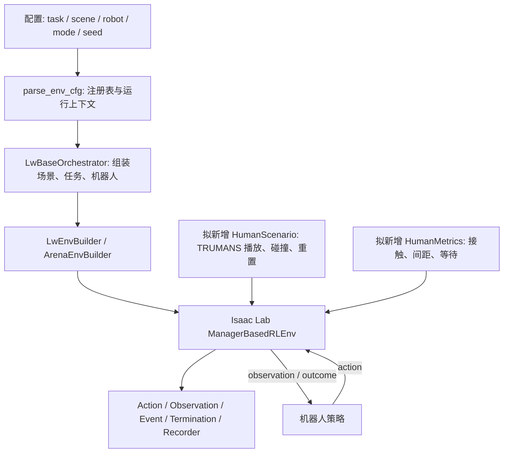

# Lightwheel baseline 与 TRUMANS avatar 扩展评估

日期：2026-09-09。结论：可行，适合以 LW-BenchHub 的场景、任务、机器人和评测接口为基础，建立 human-present 扩展。当前已有单任务共仿真证明，但尚未形成统一的 baseline 评测协议。

本报告基于本地固定提交 `b2bcb2d00edef691f9fcc49039cbf0bcc7464605`、项目的 Isaac Lab 3 迁移代码和实际运行结果；另核对官方文档与数据目录。以下“建议接口/实验设计”尚未实现。

## 1. 架构及可复用边界

| 层 | 本地源码入口 | 能复用什么 / 要补什么 |
|---|---|---|
| 注册与组装 | `lw_benchhub/utils/env.py:parse_env_cfg`、`core/env_builder/env_builder.py` | scene、task、robot、rl 独立查注册表；builder 合并观测与 manager 配置。可增加人体场景配置组合器。 |
| 场景与物体 | `core/scenes/`、`core/models/fixtures/` | 厨房资产、fixture 控制、物体放置。人体动作必须针对实际碰撞几何校验。 |
| 任务 | `core/tasks/base.py:LwTaskBase`、`lw_benchhub_tasks/` | 语言指令、任务初始化、`_check_success`。建议保留原目标，额外报告有人时的指标。 |
| 机器人 | `core/robots/robot_arena_base.py`、`compositional/pandaomron.py` | embodiment 决定相机、动作、关节和末端坐标约定。换模型前必须对齐这些接口。 |
| 策略 | `policy/base.py`、`policy/PI/pi_policy.py`、`policy/GR00T/gr00t_policy.py` | 已有 PI 与 GR00T adapter；包含模型加载、观测转换、action chunk 执行和 reset。adapter 的存在不代表已有适配 PandaOmron 的有效权重。 |
| 进程分离 | `lw_benchhub/distributed/proxy.py`、`ipc.py`、`restful.py` | `eval_policy.py` 通过 `RemoteEnv` 连接仿真服务，可分开仿真与模型依赖。所检查的 proxy 路径使用 multiprocessing manager RPC；不把全部调用都视为已验证的零拷贝。 |
| 数据与训练 | teleop/replay/converter 脚本、`lw_benchhub_rl/lift_obj/` | 有采集、回放、转换及 RL 基础。当前检查到的独立 RL 示例集中在 LiftObj，不能推定每个任务都有现成训练配置和权重。 |

官方同样将其定位为基于 Arena 的多机器人厨房训练与评测框架，支持数据采集及模型侧/仿真侧分离。[官方架构概览](https://docs.lightwheel.net/lw_benchhub)

## 2. 当前项目已完成什么

- 新版运行时中，OpenDrawer 已验证初始化、相机和 fixture 成功判定探针；未验证机器人策略开抽屉。
- NavigateKitchen + PandaOmron + 真实 TRUMANS 已完成一次固定布局、固定路线的停让导航。
- 白色机械臂作业 744897 完成 21.22 秒仿真，原任务位置/朝向谓词通过，8 项自定义验收通过，报告人机接触峰值 0 N。
- 现有人体模块可复用：`isaac_human/motion.py` 的读取、SLERP/FK 与蒙皮；`adapter.py` 的胶囊碰撞和机器人过滤接触传感器；`retarget.py` 的外观重定向。

[当前实现说明](../lw_benchhub_lab3/HUMAN_NAVIGATION.md) · [实际结果](../outputs/lw_benchhub_lab3/results/human_744897/result.json)

**必须准确界定这段结果：这是完成原任务目标的集成演示，不是官方默认 episode 协议下的 baseline 分数。**

`LwTaskBase.modify_env_cfg` 明确设置 `episode_length_s = 8.0`、100 Hz physics、50 Hz control。现有演示在 `run_human_navigation.py` 内直接执行 action manager 和 `sim.step`，查询 `_check_success`，没有走完整 `env.step` 的 episode、termination、自动 reset 与 recorder 流程。21.22 秒任务成功不能直接当成默认 8 秒协议成功。正式扩展可明确指定更长时限，但有人/无人及所有方法必须采用相同规则，且结果标注为扩展协议。

## 3. baseline 能怎么做

建议先固定 PandaOmron 和 NavigateKitchen，把现有工程投入用于完成一个可复现评测闭环。下面是建议实验矩阵，不是已有实验结果。

| 条件 / 方法 | 人体条件 | 策略可见的人体信息 | 用途 |
|---|---|---|---|
| 名义策略，无人环境 | 无 | 无 | 先确认任务本身可完成 |
| 同一名义策略，有人环境 | 固定测试动作集 | 不增加人体专用输入 | 测量人体出现造成的性能下降；RGB 中仍可能看到人体 |
| 当前状态避让 | 同一动作集 | 当前检测/骨架或当前真值，分别标记 | 简单距离阈值停让基线 |
| 预测避让 | 同一动作集 | 当前和历史信息，未来由预测器估计 | 研究方法或预测模块 baseline |
| Oracle 未来避让 | 同一动作集 | 真实未来人体轨迹 | privileged 对照，不与感知受限方法混称公平输入 |

**现有演示属于 privileged、读取真实未来的停让实现。** `navigation.py:clearance` 查询当前到未来 0.8 秒的真实 motion，不能将它命名为仅基于当前状态的 reactive baseline，也不能把已知未来片段当作预测器输出。

第一轮可用脚本导航策略比较这些条件。它目前使用人工航点，并不具备跨布局规划能力。若研究主线是操作/VLA，再增加一个短操作任务：先验证无人 LiftObj 或简单放置策略，再加入人体靠近、穿越工作区或伸手干扰。OpenDrawer 涉及抓取和关节物体交互，虽已完成环境迁移，仍需要先获得有效的无人开抽屉策略。

### 学习型 baseline 的实际成本

- PI/GR00T：已有接入代码，但需要真实 checkpoint、相机名称/图像格式、关节顺序、归一化与动作空间一致。PandaOmron-Rel 当前动作是 6 维末端相对位姿、1 维夹爪、4 维底盘/升降动作，共 11 维；不是通用的 7 维关节目标接口。
- ACT / Diffusion Policy：可以实现 adapter 接入，所检查的 `policy/__init__.py` 仅导出 PI 与 GR00T；不能宣称本版本已有 ACT/DP 的开箱即用策略。
- RL：可以复用训练基础，但人机避让的观测、奖励、终止与多环境人体播放需要补齐；当前 `IsaacHuman` 显式只支持单环境人体，不能直接把环境数改成 4096。
- 数据：官方当前 `lightwheel_tasks` 卡片列出 G1、Double-Piper、X7S 的数据，没有在该目录列出 PandaOmron。因此继续 PandaOmron 应先确认另有匹配数据/权重，否则准备自行采集；若优先利用现成数据，可评估列出的机器人，再承担对应机器人的迁移验证成本。[官方数据目录](https://huggingface.co/datasets/LightwheelAI/lightwheel_tasks/raw/main/README.md)

## 4. TRUMANS avatar 应怎样接入

建议将它做成独立的 `HumanScenario` 组件，与原 Task、Scene、Embodiment 组合，不为每个任务复制一套人体逻辑。TRUMANS 负责生成或提供人体动作，avatar 负责显示，运动学胶囊负责物理代理；人体并不是要训练的机器人 policy。官方 TRUMANS 示例支持在可编辑室内场景中根据轨迹生成动作。[TRUMANS 官方代码](https://github.com/jnnan/trumans_utils)

建议模块职责（下列名称为设计）：

| 模块 | 职责 |
|---|---|
| `HumanScenarioCfg` | enabled、motion ID、外观、起始延迟、世界变换、loop/hold 行为、随机种子与观测权限 |
| `HumanMotionRuntime` | 加载已生成动作，维护每个 env 的独立仿真时钟和 episode reset；复用 MotionPlayer |
| `HumanAvatar` | 蒙皮渲染与碰撞体创建，按 physics substep 更新姿态；复用 IsaacHuman |
| `HumanObservation` | 可选的当前骨架/速度/可见性；privileged 数据与机器人正式输入分组 |
| `HumanMetrics` | 全程接触/穿透诊断、距离、等待与恢复统计；在自动 reset 前保存结果 |
| `HumanRecorder` | 保存人体帧、世界变换、动作 provenance、模型输入和 robot action，支持重放 |

执行生命周期：

1. 先固定场景、任务和机器人初态，再选择通过该场景碰撞检查的人体 motion。人体现身的 RNG 必须与物体/机器人采样 RNG 分开。
2. 创建场景后、physics 初始化前添加人体胶囊与传感器。现有 `prestartup` 接入已在单环境运行，但多环境复制与过滤路径需重新设计。
3. 每个 physics substep 在仿真前写人体姿态，仿真后采集接触。不能只在 policy 推理后或外层 Gym wrapper 的每次 `step` 更新一次。
4. 将其接入 pinned Isaac Lab 的受控子步扩展点；如果需要环境子类，保留原生计数、termination、reset、reward、observation 和 recorder 逻辑。具体 callback/API 需在实现时验证，避免恢复旧版整段 monkey patch。
5. `reset(env_ids)` 同步复位人体时钟、motion、位置、接触历史、等待状态和指标；使用 episode 相对仿真时间，不用模型推理的墙钟时间驱动人体。
6. 对 action chunk 的每个控制步执行避让检查，而不是整段 chunk 结束后才检查。停让动作由控制模式决定；绝对关节控制下“全零动作”不等于保持姿态。

当前片段是在另一 RoboCasa 布局条件下生成，再人工平移到当前 Lightwheel 通道的。扩展场景时，应从实际 LW USD 碰撞几何导出条件，离线生成并筛选动作，冻结动作库后评测；不能把任意旧片段平移进新厨房便认定 scene-conditioned motion 合法。源动作质量、接触及脚滑仍需检查。

## 5. 正式评测前必须处理的缺口

1. **episode 协议**：明确默认协议和有人扩展协议的时限；统一成功、失败、timeout。人体等待不能使某方法得到额外且未披露的预算。
2. **success 与 done 分离**：`BasePolicy.step_environment` 丢弃 `truncated`，将 `terminated` 做 `any()`，PI/GR00T eval 又以 terminated 返回结果。当前只有成功与超时项时已存在跨超时续跑风险；加入碰撞失败后，还可能把碰撞终止记为成功。评测器必须按 env 分别读取任务成功、接触失败与 timeout，并处理自动 reset 前的 terminal 状态。
3. **数据记录迁移**：迁移脚本停用了旧 reset/step/recorder 等 monkey patches。需要验证 ep_meta、关节目标、人体状态和图像的新版记录链路，不能依据旧 README 宣称采集链路已通过。
4. **多环境**：当前人体 adapter 的 B=1 限制、绝对 prim 路径、接触过滤、env origin、独立 reset、跨环境碰撞均需处理。先把单环境多 episode 做可靠，再扩并行。
5. **传感与安全指标**：现有 0.65 m 圆盘是导航避让代理，不是全机械臂真实表面距离。报告的 0 N 尚未做正接触灵敏度标定；操作任务应加入机器人各 link 的几何距离/接触验证，避免传感器漏报被算作安全。
6. **无泄漏对比**：人体真实未来只供离线评分/oracle 使用；比较预测算法时统一当前/历史观测。让所有策略看到同一版本场景和人体动作，不能按策略结果重新选取更容易的片段。

## 6. 建议最小研究路线

先做 1 个机器人、1–3 个任务、小规模固定 manifest；不急于覆盖官方全部任务。

- **阶段 A：评测底座。** 把 HumanScenario 接进标准 env.step/reset；无人时与迁移后的同版本原环境对齐。检查 timeout、接触失败和成功各至少一个可控案例，以及重复 reset 无人体状态残留。
- **阶段 B：第一组 baseline。** NavigateKitchen 上完成名义策略无/有人、当前状态停让、oracle 未来停让，使用同一个任务预算。再接真实预测模块，用相同观测条件比较。
- **阶段 C：短操作任务。** 先建立无人任务成功率，再加人体干扰。若需要学习型策略，先跑通匹配 embodiment 的训练数据、checkpoint 和观测动作回放。
- **阶段 D：泛化。** 分离训练/验证/测试的 motion 源序列与场景布局；增加外观变化。相邻帧、同片段的时间切片不能跨集合冒充新动作。

建议首轮工程实验用每任务 20–50 个固定测试 episode，先定位失败，再扩大样本量；这不是充分统计把握度的承诺。使用配对 episode 比较并报告置信区间，研究结论所需样本量由实际方差和效应决定。

Manifest 至少记录：任务、布局/风格、资产版本或哈希、机器人初态、物体初态、scene seed、motion ID/哈希、motion seed、avatar、世界变换、开始时间、时间缩放、episode 预算、相机、控制周期、成功/接触阈值。记录模型 checkpoint、归一化统计与代码版本。

核心指标：原任务成功率；任务成功且无接触的比例（两者分开报）；episode 人机接触率/持续时间；机器人几何最小间距及近距离时间；完成时间、路径长度和等待时间；超时、死锁和恢复率。距离与接触阈值属于实验定义，不等同于经过认证的真实机器人安全标准。

推荐路径：以 Lightwheel 为任务与资产底座，以 TRUMANS 为固定且可复现的人体动态条件，先完成单环境多 episode 的公平 baseline，再推进学习型操作策略与多环境规模化。

## 本次检查的主要源码

- [配置入口](../external/LW-BenchHub/lw_benchhub/utils/env.py)
- [Builder](../external/LW-BenchHub/lw_benchhub/core/env_builder/env_builder.py)
- [任务与默认时限](../external/LW-BenchHub/lw_benchhub/core/tasks/base.py)
- [PandaOmron 动作配置](../external/LW-BenchHub/lw_benchhub/core/robots/compositional/pandaomron.py)
- [策略基类及 step 返回处理](../external/LW-BenchHub/policy/base.py)
- [官方策略评测入口](../external/LW-BenchHub/lw_benchhub/scripts/policy/eval_policy.py)
- [现有演示手动步进](../lw_benchhub_lab3/run_human_navigation.py)
- [现有未来轨迹查询](../lw_benchhub_lab3/navigation.py)
- [人体 adapter](../isaac_human/adapter.py)
- [迁移脚本](../lw_benchhub_lab3/migrate.py)
